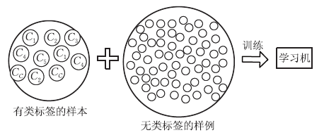
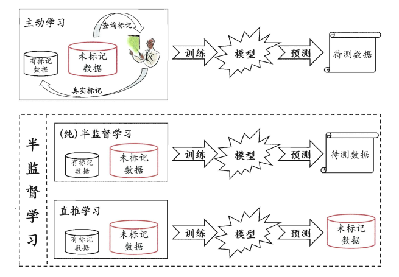
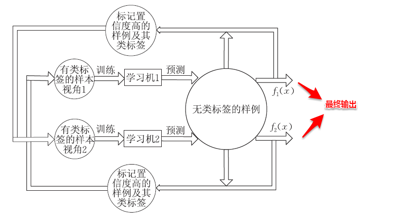

## 半监督学习
&emsp;&emsp;上篇主要介绍了机器学习的理论基础，首先从独立同分布引入泛化误差与经验误差，接着介绍了PAC可学习的基本概念，即以较大的概率学习出与目标概念近似的假设（泛化误差满足预设上限），对于有限假设空间：（1）可分情形时，假设空间都是PAC可学习的，即当样本满足一定的数量之后，总是可以在与训练集一致的假设中找出目标概念的近似；（2）不可分情形时，假设空间都是不可知PAC可学习的，即以较大概率学习出与当前假设空间中泛化误差最小的假设的有效近似（Hoeffding不等式）。对于无限假设空间，通过增长函数与VC维来描述其复杂度，若学习算法满足经验风险最小化原则，则任何VC维有限的假设空间都是（不可知）PAC可学习的，同时也给出了泛化误差界与样本复杂度。稳定性则考察的是输入发生变化时输出的波动，稳定性通过损失函数与假设空间的可学习理论联系在了一起。本篇将讨论一种介于监督与非监督学习之间的学习算法——半监督学习。  

&emsp;&emsp;前面我们一直围绕的都是监督学习与无监督学习，监督学习指的是训练样本包含标记信息的学习任务，例如：常见的分类与回归算法；无监督学习则是训练样本不包含标记信息的学习任务，例如：聚类算法。在实际生活中，常常会出现一部分样本有标记和较多样本无标记的情形，例如：做网页推荐时需要让用户标记出感兴趣的网页，但是少有用户愿意花时间来提供标记。若直接丢弃掉无标记样本集，使用传统的监督学习方法，常常会由于训练样本的不充足，使得其刻画总体分布的能力减弱，从而影响了学习器泛化性能。那如何利用未标记的样本数据呢？  
&emsp;&emsp;一种简单的做法是通过专家知识对这些未标记的样本进行打标，但随之而来的就是巨大的人力耗费。若我们先使用有标记的样本数据集训练出一个学习器，再基于该学习器对未标记的样本进行预测，从中**挑选出不确定性高或分类置信度低的样本来咨询专家并进行打标**，最后使用扩充后的训练集重新训练学习器，这样便能大幅度降低标记成本，这便是**主动学习**（active learning），其目标是**使用尽量少的/有价值的咨询来获得更好的性能**。  
&emsp;&emsp;显然，**主动学习需要与外界进行交互/查询/打标，其本质上仍然属于一种监督学习**。事实上，无标记样本虽未包含标记信息，但它们与有标记样本一样都是从总体中独立同分布采样得到，因此**它们所包含的数据分布信息对学习器的训练大有裨益**。如何让学习过程不依赖外界的咨询交互，自动利用未标记样本所包含的分布信息的方法便是**半监督学习**（semi-supervised learning），**即训练集同时包含有标记样本数据和未标记样本数据**。
 

 
图13-1 半监督学习示意图

&emsp;&emsp;此外，半监督学习还可以进一步划分为**纯半监督学习**和**直推学习**，两者的区别在于：前者假定训练数据集中的未标记数据并非待预测数据，而后者假定学习过程中的未标记数据就是待预测数据。主动学习、纯半监督学习以及直推学习三者的概念如下图所示：
 

 
图13-2 主动学习、纯半监督学习和直推学习

- 主动学习：每次挑选信息量最大的未标记样本咨询专家知识打标。  
- （纯）半监督学习：开放世界。
- 直推学习：封闭世界，未标记数据即待预测数据。

### 生成式方法
&emsp;&emsp;**生成式方法**（generative methods）是基于生成式模型的方法，即先对联合分布$P(x,c)$建模，从而进一步求解$P(c|x)$，**此类方法假定样本数据服从一个潜在的分布，因此需要充分可靠的先验知识**。例如：前面已经接触到的贝叶斯分类器与高斯混合聚类，都属于生成式模型。现假定总体是一个高斯混合分布，即由多个高斯分布组合形成，从而一个子高斯分布就代表一个类簇（类别）。高斯混合分布的概率密度函数如下所示：$$p(x)=\sum_{i=1}^N \alpha_i \cdot p(x|\mu_i, \Sigma_i)$$其中$\alpha_i$是混合系数，$\mu_i$是均值向量，$\Sigma_i$是协方差矩阵。  
&emsp;&emsp;不失一般性，假设类簇与真实的类别按照顺序一一对应，即第$i$个类簇对应第$i$个高斯混合成分。与高斯混合聚类类似地，这里的主要任务也是估计出各个高斯混合成分的参数以及混合系数，不同的是：对于有标记样本，不再是可能属于每一个类簇，而是只能属于真实类标对应的特定类簇。
$$L L(D_l \cup D_u)=\sum_{(x_j, y_j) \in D_l} \ln \left(\sum_{i=1}^N \alpha_i \cdot p(x_j | \mu_i, \Sigma_i) \cdot p(y_j | \Theta=i, x_j)\right) +\sum_{x_j \in D_u} \ln \left(\sum_{i=1}^N \alpha_i \cdot p(x_j | \mu_i, \Sigma_i)\right)$$其中$p(x_j | \mu_i, \Sigma_i)$表示有类标样本只在特定类簇中出现，$p(y_j | \Theta=i, x_j)$表示当且仅当$i=j$时，$p(x_j | \mu_i, \Sigma_i)$表示无类标样本可能在所有类簇中出现。  

&emsp;&emsp;直观上来看，**基于半监督的高斯混合模型有机地整合了贝叶斯分类器与高斯混合聚类的核心思想**，有效地利用了未标记样本数据隐含的分布信息，从而使得参数的估计更加准确。同样地，这里也要召唤出之前的EM大法进行求解，首先对各个高斯混合成分的参数及混合系数进行随机初始化，计算出各个PM（即$\gamma_{ji}$，第$i$个样本属于$j$类，有标记样本则直接属于特定类），再最大化似然函数（即$LL(D)$分别对$\alpha、\mu$和$\Sigma$求偏导），对参数进行迭代更新。
$$\begin{array}{l}
\displaystyle \mu_i=\frac{1}{\displaystyle \sum_{x _j \in D_u } \gamma_{j i}+l_i} \left(\sum_{x_j \in D_u} \gamma_{j i} x_j+\sum_{(x_j, y_j) \in D_l \wedge y_j=i} x_j\right) \\
\displaystyle \Sigma_i=\frac{1}{\displaystyle \sum_{x_j \in D_u} \gamma_{j i}+l_i}\left(\sum_{x_j \in D_u} \gamma_{j i}(x_j-\mu_i)(x_j-\mu_i)^T + \sum_{(x_j, y_j) \in D_l \wedge y_j=i}(x_j-\mu_i)(x_j-\mu_i)^T\right) \\
\displaystyle \alpha_i=\frac{1}{m}\left( \sum_{x_j \in D_u} \gamma_{j i}+l_i\right) 
\end{array}$$其中$l_i$是指第$i$类有标记样本数目。  

&emsp;&emsp;当参数迭代更新收敛后，对于待预测样本x，便可以像贝叶斯分类器那样计算出样本属于每个类簇的后验概率，接着找出概率最大的即可：
$$\begin{array}{l} \displaystyle p(\Theta=i | x)= \frac{\alpha_i \cdot p(x | \mu_i, \Sigma_i)}{\displaystyle \sum_{i=1}^N \alpha_i \cdot p(x | \mu_i, \Sigma_i)} \\ 
\displaystyle f(x)= \underset{j \in Y}{\arg \max } \sum_{i=1}^N p(y=j | \Theta=i, x) \cdot p(\Theta=i | x) \end{array}$$
&emsp;&emsp;可以看出：基于生成式模型的方法十分依赖于对潜在数据分布的假设，即假设的分布要能和真实分布相吻合，否则利用未标记的样本数据反倒会在错误的道路上渐行渐远，从而降低学习器的泛化性能。因此，**此类方法要求极强的领域知识和掐指观天的本领**。

### 半监督SVM
&emsp;&emsp;监督学习中的SVM试图找到一个划分超平面，使得两侧支持向量之间的间隔最大，即“**最大划分间隔**”思想。对于半监督学习，S3VM则考虑超平面需穿过数据低密度的区域。TSVM是半监督支持向量机中的最著名代表，其核心思想是：尝试为未标记样本找到合适的标记指派，使得超平面划分后的间隔最大化。TSVM采用局部搜索的策略来进行迭代求解，即首先使用有标记样本集训练出一个初始SVM，接着使用该学习器对未标记样本进行打标，这样所有样本都有了标记，并基于这些有标记的样本重新训练SVM，之后再寻找易出错样本不断调整。整个算法流程如下所示：
$$\begin{aligned} \min _{w, b, \hat{y}, \xi} & \frac{1}{2}\|w\|_2^2+C_l \sum_{i=1}^l \xi_i+C_u \sum_{i=l+1}^m \xi_i \\ 
\text { s.t. } & y_i(w^T x_i+b) \geqslant 1-\xi_i, \quad i=1,2, \ldots, l \\ 
& \hat{y}_i (w^T x_i + b) \geqslant 1-\xi_i, \quad i=l+1, l+2, \ldots, m \\ 
& \xi_i \geqslant 0, \quad i=1,2, \ldots, m \end{aligned} \tag{1}$$其中$\xi_i$是松弛变量hinge损失。

> 输入：有标记样本集$D_l=\{(x_1,y_1),(x_2,y_2),\ldots,(x_l,y_l)\}$；  
&emsp;&emsp;&emsp;未标记样本集$D_u={x_{l+1},x_{l+2},\ldots,x_{l+u}}$；  
&emsp;&emsp;&emsp;折中参数$C_l,C_u$  
过程：  
&nbsp;&nbsp;1: 用$D_l$训练一个$\text{SVM}_l$（初始SVM）；   
&nbsp;&nbsp;2: 用$\text{SVM}_l$对$D_u$中样本进行预测，得到$\hat{y}=(\hat{y}_{l+1},\hat{y}_{l+2},\ldots,\hat{y}_{l+u})$  
&nbsp;&nbsp;3: 初始化$C_u \ll C_l$  
&nbsp;&nbsp;4: **while** $C_u < C_l$ **do**
&nbsp;&nbsp;5: &emsp;&emsp;基于$D_l,D_u,\hat{y},C_l,C_u$求解式(1)，得到$(w,b),\xi$  
&nbsp;&nbsp;6: &emsp;&emsp; **while** $\exists\{i,j|(\hat{y}_i \hat{y}_j < 0) \wedge (\xi_i > 0) \wedge (\xi_j > 0) \wedge (\xi_i + \xi_j > 2)\}$ **do**（**松弛变量越大表示离超平面越近，越容易分错**）  
&nbsp;&nbsp;7: &emsp;&emsp;&emsp;&emsp;$\hat{y}_i = -\hat{y}_i $  
&nbsp;&nbsp;8: &emsp;&emsp;&emsp;&emsp;$\hat{y}_j = -\hat{y}_j $  
&nbsp;&nbsp;9: &emsp;&emsp;&emsp;&emsp;基于$D_l,D_u,\hat{y},C_l,C_u$重新求解式(1)，得到$(w,b),\xi$  
10: &emsp;&emsp;**end while**  
11: &emsp;&emsp;$C_u=\min \{2C_u,C_l\}$（**逐渐增大$C_u$**）  
12: **end while**  
输出：未标记样本的预测结果：$\hat{y}=(\hat{y}_{l+1},\hat{y}_{l+2},\ldots,\hat{y}_{l+u})$（**最终调整后的结果**）

### 基于分歧的方法
&emsp;&emsp;基于分歧的方法通过多个学习器之间的**分歧（disagreement）/多样性（diversity）**来利用未标记样本数据，协同训练就是其中的一种经典方法。**协同训练最初是针对于多视图（multi-view）数据而设计的，多视图数据指的是样本对象具有多个属性集，每个属性集则对应一个试图**。例如：电影数据中就包含画面类属性和声音类属性，这样画面类属性的集合就对应着一个视图。首先引入两个关于视图的重要性质：

> - **相容性**：即使用单个视图数据训练出的学习器的输出空间是一致的。例如都是$\{好，坏\}$、$\{+1,-1\}$等。  
- **互补性**：即不同视图所提供的信息是互补/相辅相成的，实质上这里体现的就是集成学习的思想。

&emsp;&emsp;协同训练正是很好地利用了多视图数据的“**相容互补性**”，其基本的思想是：首先基于有标记样本数据在每个视图上都训练一个初始分类器，然后让每个分类器去挑选分类置信度最高的样本并赋予标记，并将带有伪标记的样本数据传给另一个分类器去学习，从而**你依我侬/共同进步**。  
 

 
图13-3 协同训练

> 输入：有标记样本集$D_l=\{(\langle x_1^1,x_1^2 \rangle, y_1), \ldots, (\langle x_l^1,x_l^2 \rangle, y_l)\}$；  
&emsp;&emsp;&emsp;未标记样本集$D_u=\{\langle x_{l+1}^1,x_{l+1}^2  \rangle, \ldots, \langle x_{l+u}^1,x_{l+u}^2 \rangle\}$；  
&emsp;&emsp;&emsp;缓冲池大小$s$；  
&emsp;&emsp;&emsp;每轮挑选的正例数$p$；  
&emsp;&emsp;&emsp;每轮挑选的负例数$n$；  
&emsp;&emsp;&emsp;基学习算法$L$；  
&emsp;&emsp;&emsp;学习轮数$T$；
过程：  
&nbsp;&nbsp;1: 从$D_u$中随机抽取$s$个样本构成缓冲池$D_s$（**设置缓冲池，减少了每轮计算置信度的次数**）   
&nbsp;&nbsp;2: $D_u = D_u \backslash  D_s$  
&nbsp;&nbsp;3: **for** $j=1,2$ **do**  
&nbsp;&nbsp;4: &emsp;&emsp;$D_l^j=\{(x_i^j,y_i) | (\langle x_i^j, x_i^{3-j} \rangle, y_i) \in D_l\}$（**各视图的有标记样本**）  
&nbsp;&nbsp;5: **end for**  
&nbsp;&nbsp;6: **for** $t=1,2,\ldots, T$ **do**  
&nbsp;&nbsp;7: &emsp;&emsp; **for** $j=1,2$ **do**  
&nbsp;&nbsp;8: &emsp;&emsp;&emsp;&emsp;$h_j \leftarrow L(D_l^j)$（**基于每个视图训练初始学习器**）  
&nbsp;&nbsp;9: &emsp;&emsp;&emsp;&emsp;考察$h_j$在$D_s^j=\{x_i^j |\langle x_i^j, x_i^{3-j} \rangle \in D_s\}$上的分类置信度，挑选$p$个正例置信度最高的样本$D_p \subset D_s$、$n$个反例置信度最高的样本$D_n \subset D_s$；  
10: &emsp;&emsp;&emsp;&emsp; 由$D_p^j$生成伪标记正例$\tilde{D}_p^{3-j}=\{(x_i^{3-j}, +1) | x_i^j \in D_p^j\}$；  
11: &emsp;&emsp;&emsp;&emsp; 由$D_n^j$生成伪标记反例$\tilde{D}_n^{3-j}=\{(x_i^{3-j}, -1) | x_i^j \in D_n^j\}$；  
12: &emsp;&emsp;&emsp;&emsp; $D_s=D_s \backslash (D_p \cup D_n)$（**两个学习器挑选的不会有重复**）  
13: &emsp;&emsp; **end for**  
14: &emsp;&emsp; **if** $h_1, h_2$均未发生改变 **then**  
15: &emsp;&emsp;&emsp;&emsp; **break**  
16: &emsp;&emsp; **else**  
17: &emsp;&emsp;&emsp;&emsp;**for** $j=1,2$ **do**  
18: &emsp;&emsp;&emsp;&emsp;&emsp;&emsp; $D_l^j = D_l^j \cup (\tilde{D}_p^j \cup \tilde{D}_n^j)$（**加入打过伪标的未标记样本**）  
19：&emsp;&emsp;&emsp;&emsp; **end for**  
20: &emsp;&emsp;&emsp;&emsp; 从$D_u$中随机抽取$2p+2n$个样本加入$D_s$（**补充缓冲池**）  
21: &emsp;&emsp;**end if**  
22: **end for**  
输出：分类器$h_1,h_2$（**最终输出两个分类器做集成**）  

### 半监督聚类
&emsp;&emsp;前面提到的几种方法都是借助无标记样本数据来辅助监督学习的训练过程，从而使得学习更加充分/泛化性能得到提升；半监督聚类则是借助已有的监督信息来辅助聚类的过程。一般而言，监督信息大致有两种类型：  
> - **必连与勿连约束**：必连指的是两个样本必须在同一个类簇，勿连则是必不在同一个类簇。  
- **标记信息**：少量的样本带有真实的标记。

&emsp;&emsp;下面主要介绍两种基于半监督的K-Means聚类算法：第一种是数据集包含一些必连与勿连关系，另外一种则是包含少量带有标记的样本。两种算法的基本思想都十分的简单：对于带有约束关系的k-均值算法，在迭代过程中对每个样本划分类簇时，需要**检测当前划分是否满足约束关系**，若不满足则会将该样本划分到距离次小对应的类簇中，再继续检测是否满足约束关系，直到完成所有样本的划分。算法流程如下图所示：

> 输入：样本集$D=\{x_1,x_2,\ldots,x_m\}$  
&emsp;&emsp;&emsp;必连约束集合$M$；  
&emsp;&emsp;&emsp;勿连约束集合$C$；  
&emsp;&emsp;&emsp;聚类簇数$k$  
过程：  
&nbsp;&nbsp;1: 从$D$中随机选取$k$个样本作为初始均值向量$\{\mu_1,\mu_2,\ldots,\mu_k\}$  
&nbsp;&nbsp;2: **repeat**  
&nbsp;&nbsp;3: &emsp;&emsp;$C_j=\emptyset(1 \leqslant j \leqslant k)$；  
&nbsp;&nbsp;4: &emsp;&emsp;**for** $i=1,2,\ldots,m$ **do**  
&nbsp;&nbsp;5: &emsp;&emsp;&emsp;&emsp;计算样本$x_i$与各均值向量$\mu_j(1 \leqslant j \leqslant k)$的距离：$d_{ij}=\|x_i - \mu_j\|_2$；  
&nbsp;&nbsp;6: &emsp;&emsp;&emsp;&emsp;$K=\{1,2,\ldots,k\}$；  
&nbsp;&nbsp;7: &emsp;&emsp;&emsp;&emsp;is_merged=false  
&nbsp;&nbsp;8: &emsp;&emsp;&emsp;&emsp;**while** !is_merged **do**  
&nbsp;&nbsp;9: &emsp;&emsp;&emsp;&emsp;&emsp;&emsp;基于$K$找出与样本$x_i$距离最近的簇：$r=\underset{j \in K}{\arg \min} \{d_{ij}\}$  
10: &emsp;&emsp;&emsp;&emsp;&emsp;&emsp;检测将$x_i$划入聚类簇$C_r$是否会违背$M$与$C$中的约束；  
11: &emsp;&emsp;&emsp;&emsp;&emsp;&emsp;**if** !is_voilated **then**  
12: &emsp;&emsp;&emsp;&emsp;&emsp;&emsp;&emsp;&emsp;$C_r = C_r \cup \{x_i\}$  
13: &emsp;&emsp;&emsp;&emsp;&emsp;&emsp;&emsp;&emsp;is_merged=true  
14: &emsp;&emsp;&emsp;&emsp;&emsp;&emsp;**else**  
15: &emsp;&emsp;&emsp;&emsp;&emsp;&emsp;&emsp;&emsp;$K=K \backslash \{r\}$（若不满足则虚招距离次小的类簇）  
16: &emsp;&emsp;&emsp;&emsp;&emsp;&emsp;&emsp;&emsp;**if** $K=\emptyset$ **then**  
17: &emsp;&emsp;&emsp;&emsp;&emsp;&emsp;&emsp;&emsp;&emsp;&emsp;**break**并返回错误提示  
18: &emsp;&emsp;&emsp;&emsp;&emsp;&emsp;&emsp;&emsp;**end if**  
19: &emsp;&emsp;&emsp;&emsp;&emsp;&emsp;**end if**  
20: &emsp;&emsp;&emsp;&emsp;**end while**  
21: &emsp;&emsp;**end for**  
22: &emsp;&emsp;**for** $j=1,2,\ldots,k$ **do**  
23: &emsp;&emsp;&emsp;&emsp;$\displaystyle u_j=\frac{1}{|C_j|} \sum_{x \in C_j} x$  
24: &emsp;&emsp;**end for**  
25: **until** 均值向量均未更新  
输出：簇划分$\{C_1,C_2,\ldots,C_k\}$  

其中8-20表示对样本进行划分时，需检测是否满足约束关系，其他步骤均相同。

&emsp;&emsp;对于带有少量标记样本的k-均值算法，则可以**利用这些有标记样本进行类中心的指定，同时在对样本进行划分时，不需要改变这些有标记样本的簇隶属关系**，直接将其划分到对应类簇即可。算法流程如下所示：  
> 输入：样本集$D=\{x_1,x_2,\ldots,x_m\}$；  
&emsp;&emsp;&emsp;少量有标记样本$S=\bigcup_{j=1}^k S_j$；  
&emsp;&emsp;&emsp;聚类簇数$k$  
过程：  
&nbsp;&nbsp;1: **for** $j=1,2,\ldots,k$ **do**  
&nbsp;&nbsp;2: &emsp;&emsp;$\displaystyle u_j = \frac{1}{|S_j|} \sum_{x \in S_j} x$  
&nbsp;&nbsp;3: **end for**  
&nbsp;&nbsp;4: **repeat**  
&nbsp;&nbsp;5: &emsp;&emsp;$C_j=\emptyset(1 \leqslant j \leqslant k)$  
&nbsp;&nbsp;6: &emsp;&emsp;**for** $j=1,2,\ldots, k$ **do**  
&nbsp;&nbsp;7: &emsp;&emsp;&emsp;&emsp;**for all** $x \in S_j$ **do**  
&nbsp;&nbsp;8: &emsp;&emsp;&emsp;&emsp;&emsp;&emsp;$C_j=C_j \cup \{x\}$  
&nbsp;&nbsp;9: &emsp;&emsp;&emsp;&emsp;**end for**  
10: &emsp;&emsp;**end for**  
11: &emsp;&emsp;**for all** $x \in D \backslash S$ **do**  
12: &emsp;&emsp;&emsp;&emsp;计算样本$x_i$与歌均值向量$\mu_j(1 \leqslant j \leqslant k)$的距离：$d_{ij}=\|x_i-\mu_j\|_2$；  
13: &emsp;&emsp;&emsp;&emsp;找出与样本$x_i$距离最近的簇：$r=\underset{j \in \{1,2,\ldots, k\}}{\arg \min} d_{ij}$  
14: &emsp;&emsp;&emsp;&emsp;将样本$x_i$划入相应的簇：$C_r = C_r \cup \{x_i\}$（**划分无标记样本**）  
15: &emsp;&emsp;**end for**  
16: &emsp;&emsp;**for** $j=1,2,\ldots,k$ **do**  
17: &emsp;&emsp;&emsp;&emsp;$\displaystyle \mu_j=\frac{1}{|C_j|} \sum_{x \in C_j} x$；（**重新计算类中心**）  
18: &emsp;&emsp;**end for**  
19: **until** 均值向量均未更新  
输出：簇划分$\{C_1,C_2,\ldots,C_k\}$

&emsp;&emsp;上面算法过程中，1-3表示使用带标记样本各类别的均值向量作为初始类中心，6-10表示带标记样本直接划入对应类簇。

&emsp;&emsp;在此，半监督学习就介绍完毕。十分有趣的是：半监督学习将前面许多知识模块联系在了一起，足以体现了作者编排的用心。结合本篇的新知识再来回想之前自己做过的一些研究，发现还是蹚了一些浑水，也许越是觉得过去的自己傻，越就是好的兆头吧。