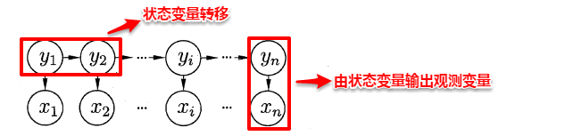
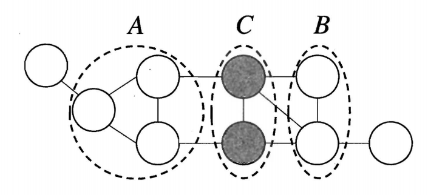
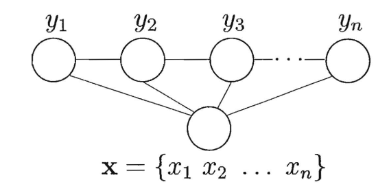
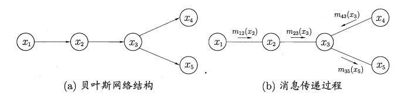
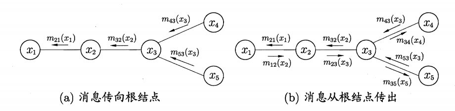
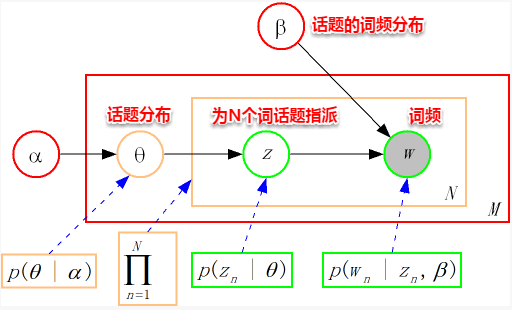

## 概率图模型
&emsp;&emsp;上篇主要介绍了半监督学习，首先从如何利用未标记样本所蕴含的分布信息出发，引入了半监督学习的基本概念，即训练数据同时包含有标记样本和未标记样本的学习方法；接着分别介绍了几种常见的半监督学习方法：生成式方法基于对数据分布的假设，利用未标记样本隐含的分布信息，使得对模型参数的估计更加准确；TSVM给未标记样本赋予伪标记，并通过不断调整易出错样本的标记得到最终输出；基于分歧的方法结合了集成学习的思想，通过多个学习器在不同视图上的协作，有效利用了未标记样本数据 ；最后半监督聚类则是借助已有的监督信息来辅助聚类的过程，带约束k-均值算法需检测当前样本划分是否满足约束关系，带标记k-均值算法则利用有标记样本指定初始类中心。本篇将讨论一种基于图的学习算法——概率图模型。  

&emsp;&emsp;现在再来谈谈机器学习的核心价值观，可以更通俗地理解为：**根据一些已观察到的证据来推断未知**，更具哲学性地可以阐述为：未来的发展总是遵循着历史的规律。其中**基于概率的模型将学习任务归结为计算变量的概率分布**，正如之前已经提到的：生成式模型先对联合分布进行建模，从而再来求解后验概率，例如：贝叶斯分类器先对联合分布进行最大似然估计，从而便可以计算类条件概率；判别式模型则是直接对条件分布进行建模。  
&emsp;&emsp;**概率图模型**（probabilistic graphical model）是一类用**图结构**来表达各属性之间相关关系的概率模型，一般而言：**图中的一个结点表示一个或一组随机变量，结点之间的边则表示变量间的相关关系**，从而形成了一张“**变量关系图**”。若使用有向的边来表达变量之间的依赖关系，这样的有向关系图称为**贝叶斯网**（Bayesian nerwork）或有向图模型；若使用无向边，则称为**马尔可夫网**（Markov network）或无向图模型。  

### 隐马尔可夫模型(HMM)
&emsp;&emsp;隐马尔可夫模型（Hidden Markov Model，简称HMM）是结构最简单的一种贝叶斯网，在语音识别与自然语言处理领域上有着广泛的应用。HMM中的变量分为两组：**状态变量**与**观测变量**，其中状态变量一般是未知的，因此又称为“**隐变量**”，观测变量则是已知的输出值。在隐马尔可夫模型中，变量之间的依赖关系遵循如下两个规则：  

> 1. **观测变量的取值仅依赖于状态变量**；
2. **下一个状态的取值仅依赖于当前状态**，通俗来讲：**现在决定未来，未来与过去无关**，这就是著名的**马尔可夫性**。

 

 
图14-1 状态变量与观测变量示意图

&emsp;&emsp;基于上述变量之间的依赖关系，我们很容易写出隐马尔可夫模型中所有变量的联合概率分布：$$P(x_1, y_1, \ldots, x_n, y_n)=P(y_1) P(x_1 | y_1) \prod_{i=2}^{n} P(y_i | y_{i-1}) P(x_i | y_i)$$&emsp;&emsp;易知：**欲确定一个HMM模型需要以下三组参数**：

- 状态转移概率矩阵：从当前状态转移到下一个状态的概率矩阵，通常记为$A$：$a_{ij}=P(y_{t+1}=s_j | y_t = s_i)$    
- 根据状态输出观测值概率矩阵，通常记为$B$：$b_{ij}=P(x_t = o_j | y_t = s_i)$  
- 初始状态概率向量，通常记为$\pi$：$\pi_i=P(y_1=s_i)$

&emsp;&emsp;当确定了一个HMM模型的三个参数后，便按照下面的规则来生成观测值序列：  
> 1. 设置$t=1$，并根据初始状态概率$\pi$选择初始状态$y_1$；（**依据初始状态概率向量**）  
2. 根据状态$y_t$和输出观测概率$B$选择观测变量取值$x_t$（**由状态产生观测值**）  
3. 根据状态$y_t$和状态转移矩阵$A$转移模型状态，即确定$y_{t+1}$（**状态转移**）  
4. 若$t<n$，设置$t=t+1$，并转到第2步，否则停止。

&emsp;&emsp;在实际应用中，HMM模型的发力点主要体现在下述三个问题上：

- 给定模型$\lambda=[A,B,\pi]$，如何有效计算其产生观测序列$\mathbf{x}=\{x_1,x_2,\ldots,x_n\}$的概率$P(\mathbf{x}|\lambda)$？换言之，如何评估模型与观测序列之间的匹配程度？（**前向算法**）  
- 给定模型$\lambda=[A,B,\pi]$和观测序列$\mathbf{x}=\{x_1,x_2,\ldots,x_n\}$，如何找到与此观测序列最匹配的状态序列$\mathbf{y}=\{y_1,y_2,\ldots,y_n\}$？换言之，如何根据观测序列推断出隐藏的模型状态？（**Viterbi算法**）
- 给定观测序列$\mathbf{x}=\{x_1,x_2,\ldots,x_n\}$，如何调整模型参数$\lambda=[A,B,\pi]$，使得该序列出现的概率$P(\mathbf{x}|\lambda)$最大？换言之，如何训练模型使能最好地描述观测数据？（**EM算法**）

#### HMM评估问题
&emsp;&emsp;HMM评估问题指的是：**给定了模型的三个参数与观测值序列，求该观测值序列出现的概率**。例如：对于赌场问题，便可以依据骰子掷出的结果序列来计算该结果序列出现的可能性，若小概率的事件发生了则可认为赌场的骰子有作弊的可能。解决该问题使用的是**前向算法**，即步步为营，自底向上的方式逐步增加序列的长度，直到获得目标概率值。在前向算法中，定义了一个**前向变量**，即给定观察值序列且$t$时刻的状态为$S_i$的概率（**前向变量**）：  
$$\partial(t, i)=P(o_1, \ldots, o_t, q_t=S_i | \lambda)$$  
基于前向变量，很容易得到该问题的递推关系及终止条件：  
$\displaystyle \partial(t+1, j)=\left[\sum_i^N \partial(t, i) a(i, j)\right] b(j, o_{t+1})$ （**递推关系**）  
$\displaystyle P(O | \lambda)=\sum_i^N \partial(T, i)$ （**终止条件**）  
&emsp;&emsp;因此可使用动态规划法，从最小的子问题开始，通过填表格的形式一步一步计算出目标结果。

#### HMM解码问题
&emsp;&emsp;HMM解码问题指的是：**给定了模型的三个参数与观测值序列，求可能性最大的状态序列**。例如：在语音识别问题中，人说话形成的数字信号对应着观测值序列，对应的具体文字则是状态序列，从数字信号转化为文字正是对应着根据观测值序列推断最有可能的状态值序列。解决该问题使用的是**Viterbi算法**，与前向算法十分类似地，Viterbi算法定义了一个**Viterbi变量**，也是采用动态规划的方法，自底向上逐步求解。
$\displaystyle \delta_t(i)=\max_{q_1, q_2, \cdots, q_{t-1}} P(q_1, q_2, \cdots, q_t=S_i, O_1, O_2 \cdots O_t | \lambda)$（**Viterbi变量**）  
$\displaystyle \delta_t(j)=\left[\max_{1 \leqslant i \leqslant N} \delta_{t-1}(i) a_{i j}\right] b_j(O_t), \quad 2 \leqslant t \leqslant T, 1 \leqslant j \leqslant N$ （**递归关系**）  
$\displaystyle \varphi_t(j)=\underset{1 \leqslant i \leqslant N}{\arg \max }[\delta_{t-1}(i) a_{i j}] b_j(O_t), \quad 2 \leqslant t \leqslant T, 1 \leqslant j \leqslant N$ （**记录最优路径**）

#### HMM学习问题
&emsp;&emsp;HMM学习问题指的是：**给定观测值序列，如何调整模型的参数使得该序列出现的概率最大**。这便转化成了机器学习问题，即从给定的观测值序列中学习出一个HMM模型，**该问题正是EM算法的经典案例之一**。其思想也十分简单：对于给定的观测值序列，如果我们能够按照该序列潜在的规律来调整模型的三个参数，则可以使得该序列出现的可能性最大。假设状态值序列也已知，则很容易计算出与该序列最契合的模型参数：  
$\hat{\pi}_i=\delta(q_1, S_i) \quad \delta(x, y)=\left\{\begin{array}{ll}{1,} & {x=y} \\ 
{0,} & {x \neq y}\end{array}\right.$ （**使用简单统计的方法**）  
$\newcommand \chfrac[2]{\frac{\;\;#1\;\;\;\;\;\;\;\;\;\;\;\;\;\;\;\;\;\;}{\;\;#2\;\;\;\;\;\;\;\;\;\;\;\;\;\;\;\;\;\;\;\;\;\;}}   
\displaystyle \hat{a}_{ij} = \chfrac{Q中从状态q_i转移到q_j的次数}{Q中从状态q_i转移到另一个状态(包括q_i本身)的次数} = \frac{\displaystyle \sum_{t=1}^{T-1}\delta(q_t,S_i) \times \delta(q_{t+1}, S_j)}{\displaystyle \sum_{t=1}^{T-1} \delta(q_t,S_i)}$  
$\newcommand \chfrac[2]{\frac{\;\;#1\;\;\;\;\;\;\;\;\;\;\;}{\;\;#2\;\;\;\;\;\;\;\;\;\;\;}} 
\displaystyle \hat{b}_j(k) = \chfrac{Q中由状态q_j输出v_k的次数}{Q到达q_j的次数} = \frac{\displaystyle \sum_{t=1}^T \delta(q_t,S_j) \times \delta(Q_t,v_k)}{\displaystyle \sum_{t=1}^T \delta(q_t,S_j)}$

&emsp;&emsp;但一般状态值序列都是不可观测的，且**即使给定观测值序列与模型参数，状态序列仍然遭遇组合爆炸**。因此上面这种简单的统计方法就行不通了，若将状态值序列看作为隐变量，这时便可以考虑使用EM算法来对该问题进行求解：  
1. 首先对HMM模型的三个参数进行随机初始化；  
2. 根据模型的参数与观测值序列，计算$t$时刻状态为$i$且$t+1$时刻状态为$j$的概率以及$t$时刻状态为$i$的概率。
$$\begin{aligned} \xi_t(i,j) 
&= P(q_t=S_i,q_{t+1}=S_j | O, \lambda) \\
&= \frac{P(q_t=S_i,q_{t+1}=S_j, O | \lambda)}{P(O|\lambda)} \\
&= \frac{\alpha_t(i)a_{ij}b_j(O_{t+1})\beta_{t+1}(j)}{P(O|\lambda)} \\
&= \frac{\alpha_t(i)a_{ij}b_j(O_{t+1})\beta_{t+1}(j)}{\displaystyle \sum_{i=1}^N \sum_{j=1}^N \alpha_t(i)a_{ij}b_j(O_{t+1})\beta_{t+1}(j)}
\end{aligned}$$其中$\xi_t(i,j)$表示$t$时刻状态为$i$，$t+1$时刻状态为$j$  
$$\gamma_{t}(i)=\sum_{j=1}^{N} \xi_{t}(i, j)$$
3. 接着便可以对模型的三个参数进行重新估计：
$\pi_i=q_1为S_i的概率=\gamma_1(i)$（**即在$t=1$时刻状态为$i$的概率**）  
$\newcommand \chfrac[2]{\frac{\;\;#1\;\;\;\;\;\;\;\;\;\;\;\;\;\;\;\;\;}{\;\;#2\;\;\;\;\;\;\;\;\;\;\;\;\;\;\;\;\;\;\;\;\;\;\;}}
\displaystyle a_{ij} = \chfrac{Q中从状态q_i转移到q_j的期望次数}{Q中从状态q_i转移到另一状态(包括q_i本身)的期望次数} = \frac{\displaystyle \sum_{t=1}^{T-1}\xi_t(i,j)}{\displaystyle \sum_{t=1}^{T-1} \gamma_t(i)}$  
$\newcommand \chfrac[2]{\frac{\;\;#1\;\;\;\;\;\;\;\;\;\;\;\;\;}{\;\;#2\;\;\;\;\;\;\;\;\;\;}}
\displaystyle b_j(k) = \chfrac{Q中由状态q_j输出v_k的期望次数}{Q到达q_j的期望次数} = \frac{\displaystyle \sum_{t=1}^T \gamma_t(j) \times \delta(O_t,v_k)}{\displaystyle \sum_{t=1}^T \gamma_t(j)}$
4. 重复步骤2-3，直至三个参数值收敛，便得到了最终的HMM模型。

### 马尔可夫随机场（MRF）
&emsp;&emsp;马尔可夫随机场（Markov Random Field）是一种典型的马尔可夫网，即使用无向边来表达变量间的依赖关系。在马尔可夫随机场中，对于关系图中的一个子集，**若任意两结点间都有边连接，则称该子集为一个团；若再加一个结点便不能形成团，则称该子集为极大团**。MRF使用**势函数**来定义多个变量的概率分布函数，其中**每个（极大）团对应一个势函数**，一般团中的变量关系也体现在它所对应的极大团中，因此常常基于极大团来定义变量的联合概率分布函数。具体而言，若所有变量构成的极大团的集合为$C$，则MRF的联合概率函数可以定义为：  
$\displaystyle P(x)=\frac{1}{Z} \prod_{Q \in C} \psi_Q(x_Q)$ （基于联合概率进行建模）  
$\displaystyle Z=\sum_{\mathbf{x}} \prod_{Q \in C} \psi_Q(x_Q)$（规范化因子，所有X可能取值，保证最终$\sum P(x) = 1$）

&emsp;&emsp;对于条件独立性，**马尔可夫随机场通过分离集来实现条件独立**，若$A$结点集必须经过$C$结点集才能到达$B$结点集，则称$C$为分离集。书上给出了一个简单情形下的条件独立证明过程，十分贴切易懂，此处不再展开。基于分离集的概念，得到了MRF的三个性质：  

> - **全局马尔可夫性**：给定两个变量子集的分离集，则这两个变量子集条件独立。
> **局部马尔可夫性**：给定某变量的邻接变量，则该变量与其它变量条件独立。
> **成对马尔可夫性**：给定所有其他变量，两个非邻接变量条件独立。

 

 
图14-2 结点集$A$和$B$被结点集$C$分离

&emsp;&emsp;对于MRF中的势函数，势函数主要用于描述团中变量之间的相关关系，且要求为非负函数，直观来看：势函数需要在偏好的变量取值上函数值较大，例如：若$x_1$与$x_2$成正相关，则需要将这种关系反映在势函数的函数值中。一般我们常使用指数函数来定义势函数：
$$\begin{array}{l}{\psi_Q(x_Q)=e^{-H_Q(x_Q)}} \\
{H_Q(x_Q)=\sum_{u, v \in Q, u \neq v } \alpha_{u v} x_u x_v+\sum_{v \in Q} \beta_v x_v}\end{array}$$其中$\alpha_{u v} x_u x_v$表示团中两个变量，$\beta_v x_v$表示团中的单个变量。

### 条件随机场（CRF）
&emsp;&emsp;前面所讲到的**隐马尔可夫模型和马尔可夫随机场都属于生成式模型，即对联合概率进行建模，条件随机场则是对条件分布进行建模**。CRF试图在给定观测值序列后，对状态序列的概率分布进行建模，即$P(y | x)$。直观上看：CRF与HMM的解码问题十分类似，都是在给定观测值序列后，研究状态序列可能的取值。CRF可以有多种结构，只需保证状态序列满足马尔可夫性即可，一般我们常使用的是**链式条件随机场**：
 

 
图14-3 链式条件随机场的图结构

&emsp;&emsp;与马尔可夫随机场定义联合概率类似地，CRF也通过团以及势函数的概念来定义条件概率$P(y|x)$。在给定观测值序列的条件下，链式条件随机场主要包含两种团结构：单个状态团及相邻状态团，通过引入两类特征函数便可以定义出目标条件概率：
$$p(y|x)=\frac{1}{Z} \exp\left(\sum_j \sum_{i=1}^{n-1} \lambda_j t_j (y_{i+1}, y_i, x, i) + \sum_k \sum_{i=1}^n \mu_k s_k (y_i,x,i) \right)$$其中$t_j (y_{i+1}, y_i, x, i)$为转移特征函数，$\lambda_j$为转移特征函数权重，$s_k (y_i,x,i)$为状态特征函数，$\mu_k$为状态特征函数权重。

&emsp;&emsp;以词性标注为例，如何判断给出的一个标注序列靠谱不靠谱呢？**转移特征函数主要判定两个相邻的标注是否合理**，例如：动词+动词显然语法不通；**状态特征函数则判定观测值与对应的标注是否合理**，例如： ly结尾的词-->副词较合理。因此我们可以定义一个特征函数集合，用这个特征函数集合来为一个标注序列打分，并据此选出最靠谱的标注序列。也就是说，每一个特征函数（对应一种规则）都可以用来为一个标注序列评分，把集合中所有特征函数对同一个标注序列的评分综合起来，就是这个标注序列最终的评分值。可以看出：**特征函数是一些经验的特性**。

### 学习与推断
&emsp;&emsp;对于生成式模型，通常我们都是先对变量的联合概率分布进行建模，接着再求出目标变量的**边际分布**（marginal distribution），那如何从联合概率得到边际分布呢？这便是学习与推断。下面主要介绍两种精确推断的方法：**变量消去**与**信念传播**。

#### 变量消去
&emsp;&emsp;变量消去利用条件独立性来消减计算目标概率值所需的计算量，它通过运用**乘法与加法的分配率**，将对变量的积的求和问题转化为对部分变量交替进行求积与求和的问题，从而将每次的**运算控制在局部**，达到简化运算的目的。
 

 
图14-4 变量消去法及其对应的消息传递过程

$$\begin{aligned} P(x_5) 
&= \sum_{x_4} \sum_{x_3} \sum_{x_2} \sum_{x_1} P(x_1, x_2, x_3, x_4, x_5) \\
&= \sum_{x_4} \sum_{x_3} \sum_{x_2} \sum_{x_1} P(x_1) P(x_2 | x_1) P(x_3 | x_2) P(x_4 | x_3) P(x_5 | x_3) (可以有多种求和顺序)\\
&= \sum_{x_3} P(x_5 | x_3) \sum_{x_4} P(x_4 | x_3) \sum_{x_2} P(x_3 | x_2) \sum_{x_1} P(x_1) P(x_2 | x_1) (最佳求和顺序)
\end{aligned}$$

#### 信念传播
&emsp;&emsp;若将变量求和操作看作是一种消息的传递过程，信念传播可以理解成：**一个节点在接收到所有其它节点的消息后才向另一个节点发送消息**，同时当前节点的边际概率正比于他所接收的消息的乘积：$$P(x_{i}) \propto \prod_{k \in n(i)} m_{k i}(x_i)$$其中$n(i)$表示$i$的邻接结点。  
&emsp;&emsp;因此只需要经过下面两个步骤，便可以完成所有的消息传递过程。利用动态规划法的思想记录传递过程中的所有消息，当计算某个结点的边际概率分布时，只需直接取出传到该结点的消息即可，从而避免了计算多个边际分布时的冗余计算问题。

> 1. 指定一个根节点，从所有的叶节点开始向根节点传递消息，直到根节点收到所有邻接结点的消息**（从叶到根）**；  
2. 从根节点开始向叶节点传递消息，直到所有叶节点均收到消息**（从根到叶）**。  

 

 
图14-5 信念传播算法图示

### LDA话题模型
&emsp;&emsp;话题模型主要用于处理文本类数据，其中**隐狄利克雷分配模型**（Latent Dirichlet Allocation，简称LDA）是话题模型的杰出代表。在话题模型中，有以下几个基本概念：词（word）、文档（document）、话题（topic）。

> - **词**：最基本的离散单元；
- **文档**：由一组词组成，词在文档中不计顺序；
- **话题**：由一组特定的词组成，这组词具有较强的相关关系。

&emsp;&emsp;在现实任务中，一般我们可以得出一个文档的词频分布，但不知道该文档对应着哪些话题，LDA话题模型正是为了解决这个问题。具体来说：**LDA认为每篇文档包含多个话题，且其中每一个词都对应着一个话题**。因此可以假设文档是通过如下方式生成：
> (1)根据参数为$\alpha$的狄利克雷分布随机采样一个话题分布$\Theta_t$（**每个话题占多少比例**）  
(2)按如下步骤生成文档中的$N$个词：  
&emsp;(a)根据$\Theta_t$进行话题指派，得到文档$t$中词$n$的话题$z_{t,n}$（**为每一个词指派话题**）  
&emsp;(b)根据指派的话题所对应的词频分布$\beta_k$（**生成具体词**）随机采样生成词

&emsp;&emsp;这样一个文档中的所有词都可以认为是通过话题模型来生成的，当已知一个文档的词频分布后（即一个$N$维向量，$N$为词库大小），则可以认为：**每一个词频元素都对应着一个话题，而话题对应的词频分布则影响着该词频元素的大小**。因此很容易写出LDA模型对应的联合概率函数：$$p(\theta, z, w | \alpha, \beta)=p(\theta | \alpha) \prod_{n=1}^N p(z_n | \theta) p(w_n | z_n, \beta)$$

 

 
图14-6 LDA话题模型示意图

&emsp;&emsp;从上图可以看出，LDA的三个表示层被三种颜色表示出来：
> - **corpus-level（红色）：** $\alpha$和$\beta$表示语料级别的参数，也就是每个文档都一样，因此生成过程只采样一次。
- **document-level（橙色）：** $\theta$是文档级别的变量，每个文档对应一个$\theta$。
- **word-level（绿色）：** $z$和$w$都是单词级别变量，$z$由$\theta$生成，$w$由$z$和$\beta$共同生成，一个单词$w$对应一个主题$z$。

&emsp;&emsp;通过上面对LDA生成模型的讨论，可以知道**LDA模型主要是想从给定的输入语料中学习训练出两个控制参数$\alpha$和$\beta$**，当学习出了这两个控制参数就确定了模型，便可以用来生成文档。其中$\alpha$和$\beta$分别对应以下各个信息：

> $\alpha$：分布$p(\theta)$需要一个向量参数，即**Dirichlet**分布的参数，用于生成一个主题$\theta$向量；  
$\beta$：各个主题对应的单词概率分布矩阵$p(w|z)$。

&emsp;&emsp;把$w$当做观察变量，$\theta$和$z$当做隐藏变量，就可以通过EM算法学习出$\alpha$和$\beta$，求解过程中遇到后验概率$p(\theta,z|w)$无法直接求解，需要找一个似然函数下界来近似求解，原作者使用基于分解（factorization）假设的变分法（varialtional inference）进行计算，用到了**EM**算法。每次**E-step**输入$\alpha$和$\beta$，计算似然函数，**M-step**最大化这个似然函数，算出$\alpha$和$\beta$，不断迭代直到收敛。