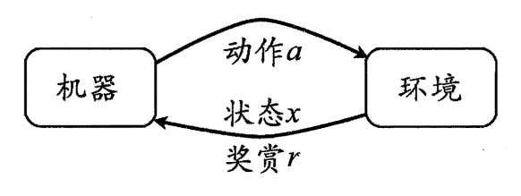
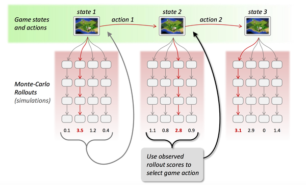
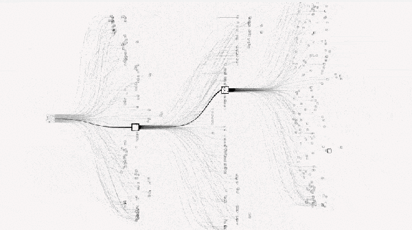

## 强化学习
&emsp;&emsp;上篇主要介绍了概率图模型，首先从生成式模型与判别式模型的定义出发，引出了概率图模型的基本概念，即利用图结构来表达变量之间的依赖关系；接着分别介绍了隐马尔可夫模型、马尔可夫随机场、条件随机场、精确推断方法以及LDA话题模型：HMM主要围绕着评估/解码/学习这三个实际问题展开论述；MRF基于团和势函数的概念来定义联合概率分布；CRF引入两种特征函数对状态序列进行评价打分；变量消去与信念传播在给定联合概率分布后计算特定变量的边际分布；LDA话题模型则试图去推断给定文档所蕴含的话题分布。本篇将介绍最后一种学习算法——强化学习。  

&emsp;&emsp;**强化学习**（Reinforcement Learning，简称**RL**）是机器学习的一个重要分支，前段时间人机大战的主角AlphaGo正是以强化学习为核心技术。在强化学习中，包含两种基本的元素：**状态**与**动作**，**在某个状态下执行某种动作，这便是一种策略**，学习器要做的就是通过不断地探索学习，从而获得一个好的策略。例如：在围棋中，一种落棋的局面就是一种状态，若能知道每种局面下的最优落子动作，那就攻无不克/百战不殆了。  
&emsp;&emsp;若将状态看作为属性，动作看作为标记，易知：**监督学习和强化学习都是在试图寻找一个映射，从已知属性/状态推断出标记/动作**，这样强化学习中的策略相当于监督学习中的分类/回归器。但在实际问题中，**强化学习并没有监督学习那样的标记信息**，通常都是在**尝试动作后才能获得结果**，因此强化学习是通过反馈的结果信息不断调整之前的策略，从而算法能够学习到：在什么样的状态下选择什么样的动作可以获得最好的结果。

### 基本要素
&emsp;&emsp;强化学习任务通常使用**马尔可夫决策过程**（Markov Decision Process，简称**MDP**）来描述，具体而言：机器处在一个环境中，每个状态为机器对当前环境的感知；机器只能通过动作来影响环境，当机器执行一个动作后，会使得环境按某种概率转移到另一个状态；同时，环境会根据潜在的奖赏函数反馈给机器一个奖赏。综合而言，强化学习主要包含四个要素：状态、动作、转移概率以及奖赏函数。

> - **状态（X）**：机器对环境的感知，所有可能的状态称为状态空间；
- **动作（A）**：机器所采取的动作，所有能采取的动作构成动作空间；
- **转移概率（P）**：当执行某个动作后，当前状态会以某种概率转移到另一个状态；
- **奖赏函数（R）**：在状态转移的同时，环境给反馈给机器一个奖赏。

 

 
图15-1 强化学习图示

&emsp;&emsp;因此，**强化学习的主要任务就是通过在环境中不断地尝试，根据尝试获得的反馈信息调整策略，最终生成一个较好的策略$\pi$，机器根据这个策略便能知道在什么状态下应该执行什么动作**。常见的策略表示方法有以下两种：  
> - **确定性策略**：$\pi(x)=a$，即在状态$x$下执行$a$动作；  
- **随机性策略**：$P=\pi(x,a)$，即在状态$x$下执行$a$动作的概率。

&emsp;&emsp;**一个策略的优劣取决于长期执行这一策略后的累积奖赏**，换句话说：可以使用累积奖赏来评估策略的好坏，最优策略则表示在初始状态下一直执行该策略后，最后的累积奖赏值最高。长期累积奖赏通常使用下述两种计算方法：  
> - T步累积奖赏：$\displaystyle E\left[\frac{1}{T} \sum_{t=1}^T r_t \right]$，即执行该策略T步的平均奖赏的期望值。    
- r折扣累积奖赏：$\displaystyle E\left[\sum_{t=0}^{+\infty} \gamma^t r_{t+1} \right]$，一直执行到最后，同时越往后的奖赏权重越低。  

### K摇摆赌博机
&emsp;&emsp;首先我们考虑强化学习最简单的情形：仅考虑一步操作，即在状态$x$下只需执行一次动作$a$便能观察到奖赏结果。易知：欲最大化单步奖赏，我们需要知道每个动作带来的期望奖赏值，这样便能选择奖赏值最大的动作来执行。若每个动作的奖赏值为确定值，则只需要将每个动作尝试一遍即可，但大多数情形下，一个动作的奖赏值来源于一个概率分布，因此需要进行多次的尝试。  
&emsp;&emsp;单步强化学习实质上是**K-摇臂赌博机**（K-armed bandit）的原型，一般我们**尝试动作的次数是有限的**，那如何利用有限的次数进行有效地探索呢？这里有两种基本的想法：  
> - **仅探索法：** 将尝试的机会平均分给每一个动作，即轮流执行，最终将每个动作的平均奖赏作为期望奖赏的近似值。  
- **仅利用法：** 将尝试的机会分给当前平均奖赏值最大的动作，隐含着让一部分人先富起来的思想。

&emsp;&emsp;可以看出：上述**两种方法是相互矛盾的**，仅探索法能较好地估算每个动作的期望奖赏，但是没能根据当前的反馈结果调整尝试策略；仅利用法在每次尝试之后都更新尝试策略，符合强化学习的思维，但容易找不到最优动作。因此需要在这两者之间进行折中。

#### $\varepsilon$-贪心
&emsp;&emsp;**$\varepsilon$-贪心法基于一个概率来对探索和利用进行折中**，具体而言：在每次尝试时，以$\varepsilon$的概率进行探索，即以均匀概率随机选择一个动作；以$1-\varepsilon$的概率进行利用，即选择当前最优的动作。$\varepsilon$-贪心法只需记录每个动作的当前平均奖赏值与被选中的次数，便可以增量式更新。

> 输入：摇臂数$K$；  
&emsp;&emsp;&emsp;奖赏函数$R$；  
&emsp;&emsp;&emsp;尝试次数$T$；  
&emsp;&emsp;&emsp;探索概率$\epsilon$   
过程：  
&nbsp;&nbsp;1: $r=0$   
&nbsp;&nbsp;2: $\forall i = 1,2,\ldots,K: Q(i)=0,\text{count}(i)=0$  
&nbsp;&nbsp;3: **for** $t=1,2,\ldots,T$ **do**  
&nbsp;&nbsp;4: &emsp;&emsp;**if** $\text{rand}() < \epsilon$ **then**  
&nbsp;&nbsp;5: &emsp;&emsp;&emsp;&emsp;$k=从1,2,\ldots,K中以均匀分布随机选取$  
&nbsp;&nbsp;6: &emsp;&emsp;**else**  
&nbsp;&nbsp;7: &emsp;&emsp;&emsp;&emsp;$k=\underset{i}{\arg\max} Q(i)$  
&nbsp;&nbsp;8: &emsp;&emsp;**end if**  
&nbsp;&nbsp;9: &emsp;&emsp;$v=R(k)$  
10: &emsp;&emsp;$r=r+v$  
11: &emsp;&emsp;$\displaystyle Q(k)=\frac{Q(k) \times \text{count}(k) + v}{\text{count}(k) + 1}$ （**增量式更新**）  
12: &emsp;&emsp;$\text{count}(k)=\text{count}(k)+1$  
13: **end for**  
输出： 累积奖赏$r$  
其中$Q(i)$为平均奖赏，$\text{count}(i)$为选中次数。

#### Softmax
&emsp;&emsp;**Softmax算法则基于当前每个动作的平均奖赏值来对探索和利用进行折中，Softmax函数将一组值转化为一组概率**，值越大对应的概率也越高，因此当前平均奖赏值越高的动作被选中的几率也越大。Softmax函数如下所示：
$$P(k)=\frac{e^{\frac{Q(k)}{\tau}}}{\displaystyle \sum_{i=1}^{K} e^{\frac{Q(i)}{\tau}}}$$其中$\tau$表示温度，$\tau \rightarrow 0$越放大差距，$\tau \rightarrow \infty$越缩小差距。

> 输入：摇臂数$K$；  
&emsp;&emsp;&emsp;奖赏函数$R$；  
&emsp;&emsp;&emsp;尝试次数$T$；  
&emsp;&emsp;&emsp;温度参数$\tau$  
过程：  
&nbsp;&nbsp;1: $r=0$  
&nbsp;&nbsp;2: $\forall i = 1,2,\ldots,K: Q(i)=0,\text{count}(i)=0$  
&nbsp;&nbsp;3: **for** $t=1,2,\ldots,T$ **do**  
&nbsp;&nbsp;4: &emsp;&emsp; $k=$从$1,2,\ldots,K$中根据Softmax函数随机选取  
&nbsp;&nbsp;5: &emsp;&emsp;$v=R(k)$  
&nbsp;&nbsp;6: &emsp;&emsp;$r =r + v$  
&nbsp;&nbsp;7: &emsp;&emsp;$\displaystyle Q(k)=\frac{Q(k) \times \text{count}(k) + v}{\text{count}(k) + 1}$  
&nbsp;&nbsp;8: &emsp;&emsp;$\text{count}(k)=\text{count}(k)+1$  
&nbsp;&nbsp;9: **end for**  
输出：累积奖赏$r$  

### 有模型学习
&emsp;&emsp;若学习任务中的四个要素都已知，即状态空间、动作空间、转移概率以及奖赏函数都已经给出，这样的情形称为“**有模型学习**”。假设状态空间和动作空间均为有限，即均为离散值，这样我们不用通过尝试便可以对某个策略进行评估。

#### 策略评估
&emsp;&emsp;前面提到：**在模型已知的前提下，我们可以对任意策略的进行评估**（后续会给出演算过程）。一般常使用以下两种值函数来评估某个策略的优劣：

> - **状态值函数（V）**：$V(x)$，即从状态$x$出发，使用$\pi$策略所带来的累积奖赏；  
- **状态-动作值函数（Q）**：$Q(x,a)$，即从状态$x$出发，执行动作$a$后再使用$\pi$策略所带来的累积奖赏。

&emsp;&emsp;根据累积奖赏的定义，我们可以引入T步累积奖赏与r折扣累积奖赏：  
$$\left\{\begin{array}{ll}
{\displaystyle V_T^{\pi}(x)=E_{\pi}\left[\frac{1}{T} \sum_{t=1}^T \tau_t | x_0=x\right],} & \text{T步累积奖赏} \\
{\displaystyle V_{\gamma}^{\pi}(x)=E_{\pi}\left[\sum_{t=0}^{+\infty} \gamma^t \tau_{t+1} | x_0=x\right], } & \gamma \text{折扣累积奖赏}\end{array}\right.$$  
$$\left\{\begin{array}{l}
{\displaystyle Q_T^{\pi}(x, a)=E_{\pi}\left[\frac{1}{T} \sum_{t=1}^T \tau_t | x_0=x, a_0=a\right]} \\ 
{\displaystyle Q_{\gamma}^{\pi}(x, a)=E_{\pi}\left[\sum_{t=0}^{+\infty} \gamma^t r_{t+1} | x_0=x, a_0=a\right]} \end{array}\right.$$
&emsp;&emsp;由于MDP具有马尔可夫性，即现在决定未来，将来和过去无关，我们很容易找到值函数的递归关系：
- T步累积奖赏：$$
\begin{aligned} V_T^{\pi}(x) 
&=E_{\pi}\left[\frac{1}{T} \sum_{t=1}^{T} \tau_t | x_0=x\right] \\ 
&=E_{\pi}\left[\frac{1}{T} \tau_{1}+ \frac{T-1}{T} \frac{1}{T-1} \sum_{t=2}^T \tau_t | x_0=x \right] \\ 
&=\sum_{a \in A} \pi(x, a) \sum_{x' \in X} P_{x \rightarrow x'}^{a}\left(\frac{1}{T} R_{x \rightarrow x'}^a+\frac{T-1}{T} E_{\pi}\left[\frac{1}{T-1} \sum_{t=1}^{T-1} \tau_t | x_0=x' \right]\right) \\ 
&=\sum_{a \in A} \pi(x, a) \sum_{x' \in X} P_{x \rightarrow x'}^a \left(\frac{1}{T} R_{x \rightarrow x'}^a+\frac{T-1}{T} V_{T-1}^{\pi}(x')\right) \end{aligned}$$

类似地，对于r折扣累积奖赏可以得到：
$$V_{\gamma}^{\pi}(x)=\sum_{a \in A} \pi(x, a) \sum_{x' \in X} P_{x \rightarrow x'}^a \left(R_{x \rightarrow x'}^a+\gamma V_{\gamma}^{\pi}(x')\right)$$
&emsp;&emsp;易知：**当模型已知时，策略的评估问题转化为一种动态规划问题**，即以填表格的形式自底向上，先求解每个状态的单步累积奖赏，再求解每个状态的两步累积奖赏，一直迭代逐步求解出每个状态的T步累积奖赏。算法流程如下所示：

> 输入：MDP四元组$E=\langle X,A,P,R \rangle$  
&emsp;&emsp;&emsp;被评估的策略$\pi$  
&emsp;&emsp;&emsp;累积奖赏参数$T$  
&nbsp;&nbsp;1: $\forall x\in X: V(x)=0$（**即最优一个状态的值函数，由于不再执行动作/转移，因此值函数为0**）  
&nbsp;&nbsp;2: **for** $t=1,2,\ldots$ **do**  
&nbsp;&nbsp;3: &emsp;&emsp; $\displaystyle \forall x \in X : V'(x) = \sum_{a \in A} \pi(x,a) \sum_{x' \in X} P_{x \rightarrow x'}^a \left(\frac{1}{t} R_{x \rightarrow x'}^a + \frac{t-1}{t} V(x') \right)$  
&nbsp;&nbsp;4: &emsp;&emsp;**if** $t=T+1$ **then**  
&nbsp;&nbsp;5: &emsp;&emsp;&emsp;&emsp;**break**  
&nbsp;&nbsp;6: &emsp;&emsp;**else**  
&nbsp;&nbsp;7: &emsp;&emsp;&emsp;&emsp;$V=V'$（**记录每个状态的$t$步累积奖赏值**）  
&nbsp;&nbsp;8: &emsp;&emsp;**end if**  
&nbsp;&nbsp;9: **end for**  
输出：状态值函数$V$  

对于状态-动作值函数，只需通过简单的转化便可得到：$$
\left\{ \begin{array}{l}
{\displaystyle Q_T^{\pi}(x, a)=\sum_{x' \in X} P_{x \rightarrow x'}^a \left(\frac{1}{T} R_{x \rightarrow x'}^a+\frac{T-1}{T} V_{T-1}^{\pi}(x')\right)} \\ 
{\displaystyle Q_{\gamma}^{\pi}(x, a)=\sum_{x' \in X} P_{x \rightarrow x'}^{a}\left(R_{x \rightarrow x'}^a+\gamma V_{\gamma}^{\pi}(x')\right)}
\end{array}\right.$$

#### 策略改进
&emsp;&emsp;理想的策略应能使得每个状态的累积奖赏之和最大，简单来理解就是：不管处于什么状态，只要通过该策略执行动作，总能得到较好的结果。因此对于给定的某个策略，我们需要对其进行改进，从而得到**最优的值函数**。
$$\left\{\begin{array}{l}
\displaystyle V_T^*(x)=\max _{a \in A} \sum_{x' \in X} P_{x \rightarrow x'}^a \left(\frac{1}{T} R_{x \rightarrow x'}^a+\frac{T-1}{T} V_{T-1}^* (x')\right) \\
\displaystyle V_{\gamma}^*(x)=\max _{a \in A} \sum_{x' \in X} P_{x \rightarrow x'}^a \left(R_{x \rightarrow x'}^a+\gamma V_{\gamma}^*(x')\right)
\end{array}\right.$$选择当前最优的动作。  
$$\left\{\begin{array}{l}
\displaystyle Q_T^*(x, a)=\sum_{x' \in X} P_{x \rightarrow x'}^a\left(\frac{1}{T} R_{x \rightarrow x'}^a+\frac{T-1}{T} \max _{a' \in A} Q_{T-1}^*(x', a')\right) \\ 
\displaystyle Q_{\gamma}^*(x, a)=\sum_{x' \in X} P_{x \rightarrow x'}^a\left(R_{x \rightarrow x'}^a+\gamma \max _{a' \in A} Q_{\gamma}^*(x', a')\right)
\end{array}\right.$$

&emsp;&emsp;最优Bellman等式改进策略的方式为：**将策略选择的动作改为当前最优的动作**，而不是像之前那样对每种可能的动作进行求和。易知：选择当前最优动作相当于将所有的概率都赋给累积奖赏值最大的动作，因此每次改进都会使得值函数单调递增。$$\displaystyle \pi'(x)=\underset{a \in A}{\arg \max } Q^{\pi}(x, a)$$

&emsp;&emsp;将策略评估与策略改进结合起来，我们便得到了生成最优策略的方法：先给定一个随机策略，现对该策略进行评估，然后再改进，接着再评估/改进一直到策略收敛、不再发生改变。这便是策略迭代算法，算法流程如下所示：

> 输入：MDP四元组$E=\langle X,A,P,R \rangle$  
&emsp;&emsp;&emsp;累积奖赏参数$T$  
过程：  
&nbsp;&nbsp;1: $\displaystyle \forall x \in X: V(x)=0, \pi(x,a)=\frac{1}{|A(x)|}$（**随机策略**）   
&nbsp;&nbsp;2: **loop**  
&nbsp;&nbsp;3: &emsp;&emsp;**for** $t=1,2,\ldots$ **do**  
&nbsp;&nbsp;4: &emsp;&emsp;&emsp;&emsp;$\displaystyle \forall x \in X: V'(x)=\sum_{a \in A} \pi(x,a) \sum_{x' \in X} P_{x \rightarrow x'}^a \left(\frac{1}{t} R_{x \rightarrow x'}^a  + \frac{t-1}{t} V(x')\right)$（**使用动态规划法计算**）  
&nbsp;&nbsp;5: &emsp;&emsp;&emsp;&emsp;**if** $t=T+1$ **then**   
&nbsp;&nbsp;6: &emsp;&emsp;&emsp;&emsp;&emsp;&emsp;**break**  
&nbsp;&nbsp;7: &emsp;&emsp;&emsp;&emsp;**else**  
&nbsp;&nbsp;8: &emsp;&emsp;&emsp;&emsp;&emsp;&emsp;$V=V'$  
&nbsp;&nbsp;9: &emsp;&emsp;&emsp;&emsp;**end if**  
10: &emsp;&emsp;**end for**（**得到当前策略的T步状态值函数**）    
11: &emsp;&emsp;$\forall x \in X: \pi'(x)= \underset{a \in A}{\arg \max}Q(x,a)$（**依据状态值函数更新策略**）  
12: &emsp;&emsp;**if** $\forall x: \pi'(x)=\pi(x)$ **then**  
13: &emsp;&emsp;&emsp;&emsp;**break**  
14: &emsp;&emsp;**else**  
15: &emsp;&emsp;&emsp;&emsp;$\pi=\pi'$  
16: &emsp;&emsp;**end for**  
17: **end loop**  
输出：最优策略$\pi$  

&emsp;&emsp;可以看出：策略迭代法在每次改进策略后都要对策略进行重新评估，因此比较耗时。若从最优化值函数的角度出发，即先迭代得到最优的值函数，再来计算如何改变策略，这便是值迭代算法，算法流程如下所示：

> 输入：MDP四元组$E=\langle X,A,P,R \rangle$  
&emsp;&emsp;&emsp;累积奖赏参数$T$  
&emsp;&emsp;&emsp;收敛阈值$\theta$  
过程：  
&nbsp;&nbsp;1: $\forall x \in X: V(x)=0$   
&nbsp;&nbsp;2: **for** $t=1,2,\ldots$ **do**  
&nbsp;&nbsp;3: &emsp;&emsp;$\displaystyle \forall x \in X: V'(x)= \max_{a \in A} \sum_{x' \in X} P_{x \rightarrow x'}^a \left(\frac{1}{t} R_{x \rightarrow x'}^a  + \frac{t-1}{t} V(x')\right)$ （**每次都选择最优动作**）  
&nbsp;&nbsp;4: &emsp;&emsp;**if** $\displaystyle \max_{x \in X} |V(x)-V'(x)| < \theta$ **then**  
&nbsp;&nbsp;5: &emsp;&emsp;&emsp;&emsp;**break**  
&nbsp;&nbsp;6: &emsp;&emsp;**else**  
&nbsp;&nbsp;7: &emsp;&emsp;&emsp;&emsp;$V=V'$  
&nbsp;&nbsp;8: &emsp;&emsp;**end if**  
&nbsp;&nbsp;9: **end for**（**得到了最优的值函数**）  
输出：策略$\pi(x)=\underset{a \in A}{\arg \max}Q(x,a)$（**根据最优值函数阿里改变策略**）    

### 蒙特卡罗强化学习
&emsp;&emsp;在现实的强化学习任务中，**环境的转移函数与奖赏函数往往很难得知**，因此我们需要考虑在不依赖于环境参数的条件下建立强化学习模型，这便是**免模型学习**。蒙特卡罗强化学习便是其中的一种经典方法。  
&emsp;&emsp;由于模型参数未知，状态值函数不能像之前那样进行全概率展开，从而运用动态规划法求解。一种直接的方法便是通过采样来对策略进行评估/估算其值函数，**蒙特卡罗强化学习正是基于采样来估计状态-动作值函数**：对采样轨迹中的每一对状态-动作，记录其后的奖赏值之和，作为该状态-动作的一次累积奖赏，通过多次采样后，使用累积奖赏的平均作为状态-动作值的估计，并**引入$\varepsilon$-贪心策略保证采样的多样性**。

> 输入：环境$E$  
&emsp;&emsp;&emsp;动作空间$A$  
&emsp;&emsp;&emsp;起始状态$x_0$  
&emsp;&emsp;&emsp;策略执行步数$T$  
过程：  
&nbsp;&nbsp;1: $\displaystyle Q(x,a)=0, \text{count}(x,a)=0,\pi(x,a)=\frac{1}{|A(x)|}$（**随机策略**） 
&nbsp;&nbsp;2: **for** $s=1,2,\ldots$ **do**  
&nbsp;&nbsp;3: &emsp;&emsp;在$E$中执行策略$\pi$产生轨迹：$<x_0,a_0,r_1,x_1,a_1,r_2,\ldots,x_{T-1},a_{T-1},r_T,x_T>$  
&nbsp;&nbsp;4: &emsp;&emsp;**for** $t=0,1,\ldots,T-1$ **do**  
&nbsp;&nbsp;5: &emsp;&emsp;&emsp;&emsp;$\displaystyle R=\frac{1}{T-t}\sum_{i=t+1}^T r_i$ （**状态-动作的$T-t$步累积奖赏**）    
&nbsp;&nbsp;6: &emsp;&emsp;&emsp;&emsp;$\displaystyle Q(x_t,a_t)=\frac{Q(x_t,a_t) \times \text{count}(x_t,a_t) + R}{\text{count}(x_t,a_t) + 1}$ （**更新状态-动作值函数**）  
&nbsp;&nbsp;7: &emsp;&emsp;&emsp;&emsp;$\text{count}(x_t,a_t)=\text{count}(x_t,a_t)+1$  
&nbsp;&nbsp;8: &emsp;&emsp;**end for**  
&nbsp;&nbsp;9: &emsp;&emsp;对所有已见状态$x$：$\pi(x,a)=\left\{ \begin{array}{ll} \underset{a'}{\arg \max} Q(x, a'), & 以概率1-\epsilon \\
以均匀概率从A中选取动作, & 以概率\epsilon
\end{array} \right.$  
10: **end for**  
输出：策略$\pi$  

&emsp;&emsp;在上面的算法流程中，被评估和被改进的都是同一个策略，因此称为**同策略蒙特卡罗强化学习算法**。引入$\varepsilon$-贪心仅是为了便于采样评估，而在使用策略时并不需要$\varepsilon$-贪心，那能否仅在评估时使用$\varepsilon$-贪心策略，而在改进时使用原始策略呢？这便是**异策略蒙特卡罗强化学习算法**。

> 输入：环境$E$  
&emsp;&emsp;&emsp;动作空间$A$  
&emsp;&emsp;&emsp;起始状态$x_0$  
&emsp;&emsp;&emsp;策略执行步数$T$  
过程：  
&nbsp;&nbsp;1: $\displaystyle Q(x,a)=0, \text{count}(x,a)=0,\pi(x,a)=\frac{1}{|A(x)|}$  
&nbsp;&nbsp;2: **for** $s=1,2,\ldots$ **do**  
&nbsp;&nbsp;3: &emsp;&emsp;在$E$中执行$\pi$的$\epsilon$-贪心策略产生轨迹：$<x_0,a_0,r_1,x_1,a_1,r_2,\ldots,x_{T-1},a_{T-1},r_T,x_T>$  
&nbsp;&nbsp;4: &emsp;&emsp;$p_i= \left\{ \begin{array}{lll}
1-\epsilon+\epsilon/|A|, & a_i = \pi(x); & (选择当前最优动作的概率) \\
\epsilon/|A|, & a_i \neq \pi(x), & (选择随机动作的概率)
\end{array} \right.$  
&nbsp;&nbsp;5:&emsp;&emsp;**for** $t=0,1,\ldots,T-1$ **do**  
&nbsp;&nbsp;6:&emsp;&emsp;&emsp;&emsp;$\displaystyle R=\frac{1}{T-t} \sum_{i=t+1}^T(r_i \times \prod_{j=i}^{T-1} \frac{1}{p_j})$ （**修正的累积奖赏**）  
&nbsp;&nbsp;7:&emsp;&emsp;&emsp;&emsp;$\displaystyle Q(x_t,a_t)=\frac{Q(x_t,a_t) \times \text{count}(x_t, a_t) + R}{\text{count}(x_t, a_t) + 1}$  
&nbsp;&nbsp;8:&emsp;&emsp;&emsp;&emsp;$\text{count}(x_t, a_t) = \text{count}(x_t, a_t) + 1$  
&nbsp;&nbsp;9:&emsp;&emsp;**end for**  
10: &emsp;&emsp;$\pi(x)=\underset{a'}{\arg \max} Q(x, a')$（**根据估计的状态-动作值函数改变策略**）  
11: **end for**  
输出：策略$\pi$  

### AlphaGo原理浅析
&emsp;&emsp;本篇一开始便提到强化学习是AlphaGo的核心技术之一，刚好借着这个东风将AlphaGo的工作原理了解一番。正如人类下棋那般“**手下一步棋，心想三步棋**”，Alphago也正是这个思想，**当处于一个状态时，机器会暗地里进行多次的尝试/采样，并基于反馈回来的结果信息改进估值函数，从而最终通过增强版的估值函数来选择最优的落子动作。**  
&emsp;&emsp;其中便涉及到了三个主要的问题：**（1）如何确定估值函数（2）如何进行采样（3）如何基于反馈信息改进估值函数**，这正对应着AlphaGo的三大核心模块：**深度学习**、**蒙特卡罗搜索树**、**强化学习**。

**1. 深度学习（拟合估值函数）**  
&emsp;&emsp;由于围棋的状态空间巨大，像蒙特卡罗强化学习那样通过采样来确定值函数就行不通了。在围棋中，**状态值函数可以看作为一种局面函数，状态-动作值函数可以看作一种策略函数**，若我们能获得这两个估值函数，便可以根据这两个函数来完成：(1)衡量当前局面的价值；(2)选择当前最优的动作。那如何精确地估计这两个估值函数呢？**这就用到了深度学习，通过大量的对弈数据自动学习出特征，从而拟合出估值函数。**

**2. 蒙特卡罗搜索树（采样）**  
&emsp;&emsp;蒙特卡罗树是一种经典的搜索框架，它通过反复地采样模拟对局来探索状态空间。具体表现在：从当前状态开始，利用策略函数尽可能选择当前最优的动作，同时也引入随机性来减小估值错误带来的负面影响，从而模拟棋局运行，使得棋盘达到终局或一定步数后停止。

 

 
图15-2 蒙特卡罗搜索树图示

**3. 强化学习（调整估值函数）**  
&emsp;&emsp;在使用蒙特卡罗搜索树进行多次采样后，每次采样都会反馈后续的局面信息（利用局面函数进行评价），根据反馈回来的结果信息自动调整两个估值函数的参数，这便是强化学习的核心思想，最后基于改进后的策略函数选择出当前最优的落子动作。

 

 
图15-3 调整估值函数

